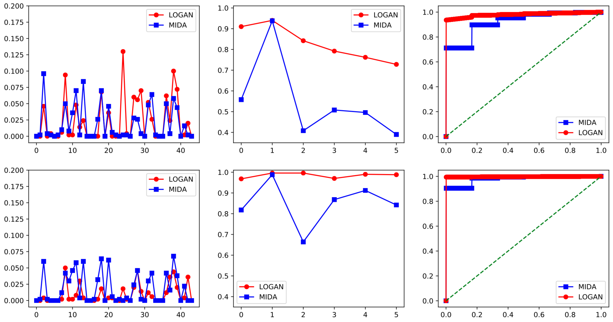
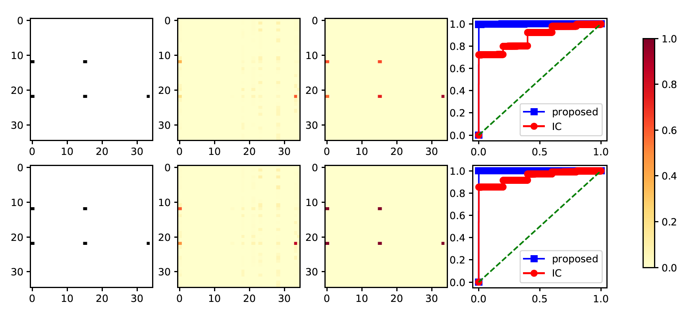

# Testing Mediation Effects Using LOGic of BooleAN Matrices (LOGAN)

This repository contains the implementation for the paper ["Testing Mediation Effects Using Logic of Boolean Matrices"](https://arxiv.org/abs/2005.04584) and ["Sequential Pathway Inference for Multimodal Neuroimaging Analysis"](http://eprints.lse.ac.uk/111904/) in Python.

## Summary of the paper

Mediation analysis is becoming an increasingly important tool in scientific studies. A central question in high-dimensional mediation analysis is to infer the significance of individual mediators. The main challenge is the sheer number of possible paths that go through all combinations of mediators. Most existing mediation inference solutions either explicitly impose that the mediators are conditionally independent given the exposure, or ignore any potential directed paths among the mediators. In this article, we propose a novel hypothesis testing procedure to evaluate individual mediation effects, while taking into account potential interactions among the mediators. Our proposal thus fills a crucial gap, and greatly extends the scope of existing mediation tests. Our key idea is to construct the test statistic using the logic of Boolean matrices, which enables us to establish the proper limiting distribution under the null hypothesis. We further employ screening, data splitting, and decorrelated estimation to reduce the bias and increase the power of the test. We show our test can control both the size
and false discovery rate asymptotically, and the power of the test approaches one, meanwhile allowing the number of mediators to diverge to infinity with the sample
size. We demonstrate the efficacy of our method through both simulations and a neuroimaging study of Alzheimer’s disease.



**Figure 1**: Empirical rejection rate and ROC curve of the proposed test, LOGAN, and the test of Chakrabortty et al. (2018), MIDA, when the dimension of the mediators d = 50. The upper panels: the sample size n = 100, and the bottom panels: n = 200. The left panels: under `H_0`, the middles panels: under `H_1`, where the horizontal axis is the mediator index, and the right panels: the average ROC curve. 



**Figure 2**: Empirical size and power when d1 = d2 = 35. First column: the vertical axis denotes the indices of the mediators in the first set, and the horizontal axis the second set. The black dots indicate the true significant mediator pairs. Second and third columns: the empirical rejection rate by the method of Chakrabortty et al. (2018), and our sequential test, respectively. Fourth column: the average ROC curve with a varying significance level. First row: n = 200, and second row: n = 400.

## File overview

* `Demonstration.ipynb` contains the main functions for the proposed test in the paper ["Testing Mediation Effects Using Logic of Boolean Matrices"](https://arxiv.org/abs/2005.04584). Please refer to this [notebook](https://github.com/callmespring/LOGAN/blob/master/Demonstration.ipynb) for detailed illustration of the implementation. It also contains the implementation of the MIDA test proposed by [Chakrabortty et al., 2018](https://arxiv.org/pdf/1809.10652.pdf). 
* `./LOGAN/sparselearn` contains subroutines for sparse high-dimensional regression with [MCP](https://arxiv.org/pdf/1002.4734.pdf) penalty function. It is built upon the [`pycasso`](https://pypi.org/project/pycasso/) module.
* `./LOGAN/notears.py` and `./LOGAN/utils.py` contain subroutines for the initial DAG estimation via the [NOTEARS](https://papers.nips.cc/paper/2018/file/e347c51419ffb23ca3fd5050202f9c3d-Paper.pdf) algorithm. These files are from earlier versions of the [`notears`](https://github.com/xunzheng/notears) module.
* `Demonstration_seq.ipynb` contains the main functions for the proposed sequential test in the paper ["Sequential Pathway Inference for Multimodal Neuroimaging Analysis"](https://onlinelibrary.wiley.com/doi/full/10.1002/sta4.433). Please refer to this [notebook](https://github.com/callmespring/LOGAN/blob/master/Demonstration_seq.ipynb) for detailed illustration of the implementation.

## Citation

Please cite our papers
[Testing Mediation Effects Using Logic of Boolean Matrices](https://arxiv.org/pdf/2005.04584.pdf) and ["Sequential Pathway Inference for Multimodal Neuroimaging Analysis"](https://onlinelibrary.wiley.com/doi/full/10.1002/sta4.433)

``` 
@article{shi2021testing,
  title={Testing Mediation Effects Using Logic of Boolean Matrices},
  author={Shi, Chengchun and Li, Lexin},
  journal={Journal of the American Statistical Association},
  volume={accepted}
  year={2021}
}
``` 

```
@article{li2022sequential,
  title={Sequential pathway inference for multimodal neuroimaging analysis},
  author={Li, Lexin and Shi, Chengchun and Guo, Tengfei and Jagust, William J},
  journal={Stat},
  volume={11},
  number={1},
  pages={e433},
  year={2022},
  publisher={Wiley Online Library}
}
```

## Contributing

All contributions welcome! All content in this repository is licensed under the MIT license.

